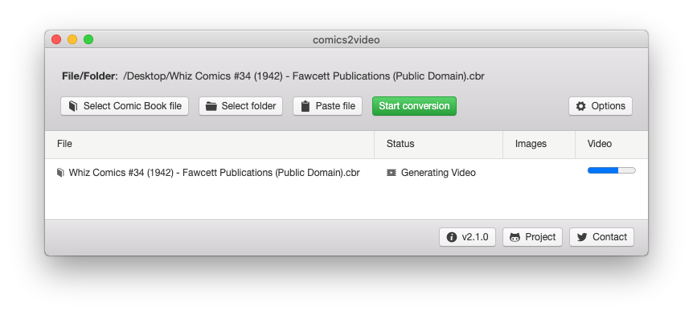

# comics2video
Converts Comic Book files to videos, to be watched on TV/Video players.

The possibility of reading a Comic Book by watching a video allows the user to be **hands-free** (no need to hold a phone or press a button/screen to change the pages) and also allow the reading by **people with disabilities/paralysis**.

> Documentation:   [English](https://github.com/MauricioPinguim/comics2video#readme) |  [Português - Brasil](https://github.com/MauricioPinguim/comics2video/blob/master/README.pt.md)

### How it works
Example using Whiz Comics #34 (1942) - Fawcett Publications (Public Domain)


Video generated by comics2video:<br/>


## Recommended usage: Ready-to-use executable

### In Windows:
1. Download the package file:
	- [comics2video 2.1.1 for Windows](https://github.com/MauricioPinguim/comics2video/releases/latest/download/comics2video_windows_latest.zip)
2. Extract the downloaded file and open the executable:


### In macOS:
> Since the file is downloaded from GitHub instead of Apple Store, follow all steps below before running comics2video for the first time
1. Download the package file:
	- [comics2video 2.1.1 for macOS](https://github.com/MauricioPinguim/comics2video/releases/latest/download/comics2video_macOS_latest.zip)
2. Extract the downloaded file
3. Right-click the file **comics2video_Prepare_First_Execution** and choose "Open" in the submenu
4. Confirm that you want to open the file. A script will be executed and show a "Done" message
5. From now on, open comics2video using the app file:


### comics2video main screen
Use the buttons to select a Comic Book file (or folder) in your file system and start the conversion

## Developer usage

### Node.js source-code
Git clone the project files, then run:

```sh
npm install
```

In Windows or macOS, start the Graphical User Interface using:

```sh
npm start
```

In Linux, start the Terminal Interface using:

```sh
node comics2video ./path/yourComicBookFile.cbr
```

If the parameter is a folder, all valid files will be processed.

### Using as a NPM module
Add comics2video to your own Node.js project using:
```sh
npm install comics2video
```
Then use:
```javascript
const Comics2video = require('comics2video');

const source = './path/myComicBook.cbr'; // File or Folder
const userParameters = { } // Parameters listed in next section

const comicsConversion = new Comics2video(source, userParameters);

// Event triggered on each status change
comicsConversion.on('progressUpdated', (data) => {
	// toString() combines all fields in 'data' object in a single string
	console.log(data.toString());
});
// Event triggered only once at the end of conversion
comicsConversion.on('processCompleted', (data) => {
	console.log(`(${data.resultType}) ${data.resultMessage}`);
});

( async () => {
	await comicsConversion.start();
})();
```

User Parameters fields (all optional):

| Name | How to set | Default | Description |
| --- | --- | --- | --- |
| generateVideo | boolean | true | If false, only the image frames will be generated |
| contentProfile | string:<br/>'simple', 'complex' | 'complex' | Changes how OCR calculates each frame duration:<br/>• 'simple' : Ideal for Comics for kids, art with few details<br />• 'complex' : For Superhero or Comics with detailed art |
| readingSpeed | string:<br/> 'slow', 'normal', 'fast' | 'normal' | Also changes how OCR calculates duration:<br/>• 'slow' : Ideal for Kids or reading in foreign language<br />• 'normal' : Normal reading speed<br />• 'fast' : For speed reading |
| messageLanguage | string:<br/> 'en', 'pt' | 'en' | Language for the Graphical User Interface and elements:<br />• 'en' : English<br />• 'pt' : Portuguese (Brazil) |

## Using the generated files
For each comic book processed, a folder with the same name will be created, containing:
- The video file in .MP4 format
	- Just open it in the TV/Video player of your choice, like a regular video. Pages will be changed automatically (pages with more text will last longer)
- A subfolder named 'Images' with all the frames in .JPG format
	- That can also be opened in modern TVs, advance each frame/page manually using the remote control

## Project comics2video

### Dependencies
Extraction from CBR/RAR files: [unrar-promise](https://www.npmjs.com/package/unrar-promise), CBZ/ZIP files: [win-7zip](https://www.npmjs.com/package/win-7zip)+[cross-zip](https://www.npmjs.com/package/cross-unzip), Image processing: [sharp](https://www.npmjs.com/package/sharp), OCR: [tesseract.js](https://www.npmjs.com/package/tesseract.js), Video generation: [ffmpeg-static](https://www.npmjs.com/package/ffmpeg-static), Graphical User Interface: [electron](https://www.npmjs.com/package/electron)+[photonkit](https://www.npmjs.com/package/photonkit)

### Next steps
- Help needed: Translate the Graphical User Interface and documentation to **Spanish** and other languages (besides English and Portuguese)
- Any good suggestions you have :wink:

### Contact
:penguin: Maurício Antunes Oliveira: [mauricio_pinguim@hotmail.com](mailto:mauricio_pinguim@hotmail.com?subject=comics2video)