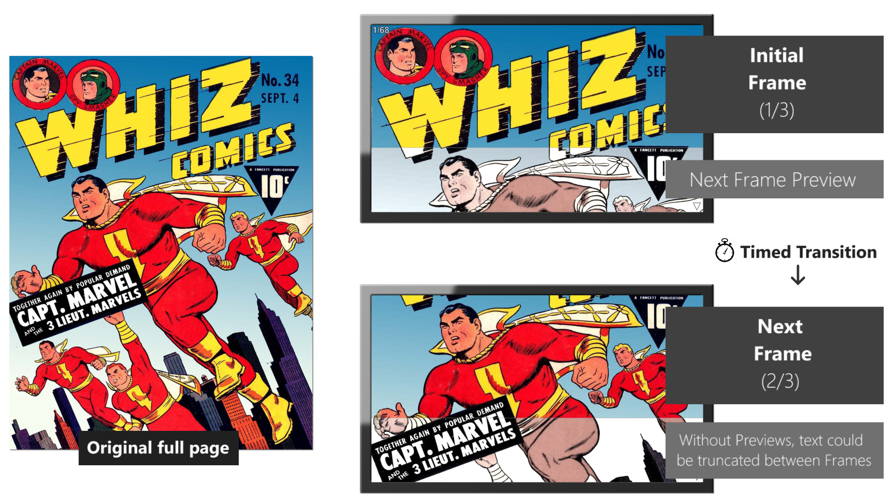

# comics2video
Converts Comic Book files to videos to be watched on TV/Video players.

The possibility of reading a Comic Book by simply watching a video will allow the user to be **hands-free** (no need to hold a phone/tablet or press a button/screen to change the pages) and also allow the reading by **people with disabilities**.

## How it works
> Example using Whiz Comics #34 (1942) - Fawcett Publications (Public Domain)


Video generated by comics2video:


## Installation
1. Git Clone or Download comics2video files from this repository 
2. Install the latest version of [Node.js](https://nodejs.org/en/download)
3. To install the dependencies, run the following command in the comics2video root folder:

```sh
npm install
```

## Usage

### Option A: Drag-and-drop comic book files
Select the Comic Book file and drag-and-drop it on the batch file located in the root folder of comics2video:

> 🗋 drop_comics_here.bat

To process multiple Comic Book files, put them in a folder and drag-and-drop the folder.

### Option B: As a standalone app
Place the Comic Book files in the **comics_files** folder and run:
```sh
node comics2video
```

Or provide the path+file as a parameter:
```sh
node comics2video ./path/myComicBook.cbr
```

Or the folder containing the comic book files:
```sh
node comics2video ./pathWithComicBooks
```

### Option C: As a Node.js module
Fisrt run a **npm install** in the comics2video root folder. After that, in your project root folder:
```sh
npm install ./pathToComics2video
```
Then use:
```javascript
const comics2video = require('comics2video');

const source = './path/myComicBook.cbr';

await comics2video.process(source);
```

### Using the generated files
For each comic book processed, a folder with the same name will be created, containing:
- The video file in .MP4 format
	- Just open it in the TV/Video player of your choice, like a regular video
- A subfolder named 'Images' with all the frames in .JPG format
	- That can also be opened in modern TVs, advance each frame/page manually using the remote control

## Project comics2video

### Dependencies
- Extraction from CBR/RAR ([unrar-promise](https://www.npmjs.com/package/unrar-promise)), CBZ/ZIP ([win-7zip](https://www.npmjs.com/package/win-7zip)+[cross-zip](https://www.npmjs.com/package/cross-unzip)) and PDF files ([pdfjs-dist](https://www.npmjs.com/package/pdfjs-dist))
- Image processing: [sharp](https://www.npmjs.com/package/sharp)
- OCR: [tesseract.js](https://www.npmjs.com/package/tesseract.js)
- Video generation: [ffmpeg-static](ffmpeg-static)

### Next steps
- Map and document the User Parameters
- Simplified text-based UI to set User Parameters (for non-developers users)
- Make it available as a module at [npmjs.com](https://www.npmjs.com)