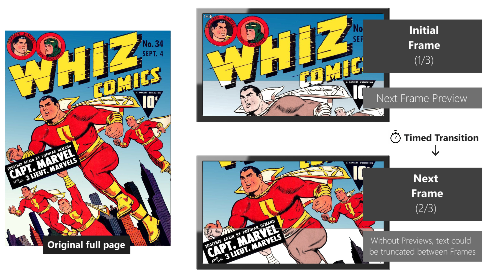
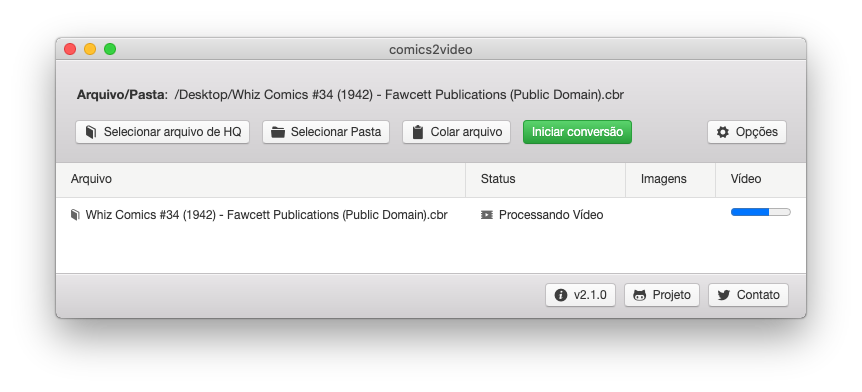

# comics2video
Converte arquivos de História em Quadrinhos em Vídeos, para serem visualizados em TVs/Video players.

Ler História em Quadrinhos por meio de vídeos permite que o usuário fique com as mãos livres, pois não há a necessidade de segurar um celular ou pressionar nenhum botão/tela para mudar de página, além de permitir a utilização por pessoas com **deficiência/paralisia**.

> Documentation:   [English](https://github.com/MauricioPinguim/comics2video#readme) |  [Português - Brasil](https://github.com/MauricioPinguim/comics2video/blob/master/README.pt.md)

### Como funciona
Exemplo utilizando "Whiz Comics #34 (1942) - Fawcett Publications" (Domínio Público)


Amostra de Vídeo gerado<br/>


## Uso recomendado: Arquivo executável pronto para rodar

### Para Windows
1. Faça o download do arquivo:
	- [comics2video 2.1.1 para Windows](https://github.com/MauricioPinguim/comics2video/releases/latest/download/comics2video_windows_latest.zip)
2. Descompacte o arquivo baixado e abra o executável:


### Para macOS:
> Por ser baixado do GitHub e não da Apple Store, siga todos os passos abaixo antes de usar o comics2video pela primeira vez
1. Faça o download do arquivo:
	- [comics2video 2.1.1 para macOS](https://github.com/MauricioPinguim/comics2video/releases/latest/download/comics2video_macOS_latest.zip)
2. Descompacte o arquivo baixado
3. Clique com o botão direito no arquivo  **comics2video_Prepare_First_Execution** e escolha "Abrir" no submenu
4. Confirme a abertura do arquivo. Um script será executado e mostrará a mensagem "Done"
5. A partir de agora, abra o comics2video usando o arquivo de aplicativo:


### Tela principal do comics2video
Use os botões para selecionar um arquivo de História em Quadrinhos (ou pasta) no seu sistema e inicie a conversão


## Uso para Desenvolvedores

### Código-fonte em Node.js
Faça o git clone deste projeto, e então use:

```sh
npm install
```

Em Windows ou macOS, inicie a Interface Gráfica com o comando:

```sh
npm start
```

Em Linux, inicie a Interface de Terminal com:

```sh
node comics2video ./path/yourComicBookFile.cbr
```

Se o último parâmetro for uma Pasta, todos os arquivos válidos dentro da mesma serão processados.

### Usando em Node.js como um Módulo NPM
Adicione o comics2video ao seu próprio projeto em Node.js com:
```sh
npm install comics2video
```
Adapte o código de exemplo a seguir:
```javascript
const Comics2video = require('comics2video');

const source = './path/myComicBook.cbr'; // File or Folder
const userParameters = { } // Parameters listed in next section

const comicsConversion = new Comics2video(source, userParameters);

// Event triggered on each status change
comicsConversion.on('progressUpdated', (data) => {
	// toString() combines all fields in 'data' object in a single string
	console.log(data.toString());
});
// Event triggered only once at the end of conversion
comicsConversion.on('processCompleted', (data) => {
	console.log(`(${data.resultType}) ${data.resultMessage}`);
});

( async () => {
	await comicsConversion.start();
})();
```

Campos da estrutrura userParameters (todos opcionais):

| Nome | Como definir | Valor padrão | Descrição |
| --- | --- | --- | --- |
| generateVideo | boolean | true | Se igual a false, apenas Imagens serão geradas |
| contentProfile | string:<br/>'simple', 'complex' | 'complex' | Muda a forma com a qual o OCR determina o tempo de duração de cada frame:<br/>• 'simple' : Para HQ infantil, arte com pouco detalhe<br />• 'complex' : Para HQ de Heróis, arte com bastante detalhe |
| readingSpeed | string:<br/> 'slow', 'normal', 'fast' | 'normal' | Também influencia o cálculo dos tempos de duração:<br/>• 'slow' : Para crianças, ou leitura em outro idioma<br />• 'normal' : Velocidade normal de leitura<br />• 'fast' : Leitura dinâmica |
| messageLanguage | string:<br/> 'en', 'pt' | 'en' | Idioma da Interface Gráfica e alguns elementos:<br />• 'en' : Inglês<br />• 'pt' : Português (Brasil) |

## Usando os arquivos gerados
Após cada processamento, uma pasta será criada com o mesmo nome do arquivo da HQ, contendo:
- O arquivo de vídeo no formato .MP4
	- Abra o mesmo na TV ou Video player de sua preferência, como um vídeo normal. O avanço será automático, com o tempo determinado pela quantidade de texto em cada página
- Uma sub-pasta chamada 'Imagens' contendo todos os frames utilizados, em formato .JPG
	- A ser utilizado na função de visualizar fotos nas TVs modernas, com o avanço manual das páginas pelo controle remoto

## Projeto comics2video

### Dependências do Código-Fonte
Extração de arquivos CBR/RAR: [unrar-promise](https://www.npmjs.com/package/unrar-promise), arquivos CBZ/ZIP: [win-7zip](https://www.npmjs.com/package/win-7zip)+[cross-zip](https://www.npmjs.com/package/cross-unzip), Processamento de Imagens: [sharp](https://www.npmjs.com/package/sharp), OCR: [tesseract.js](https://www.npmjs.com/package/tesseract.js), Geração de Vídeo: [ffmpeg-static](https://www.npmjs.com/package/ffmpeg-static), Interface Gráfica: [electron](https://www.npmjs.com/package/electron)+[photonkit](https://www.npmjs.com/package/photonkit)

### Próximos passos
- Tradução da Interface Gráfica e documentação para outros idiomas além de Inglês e Português (precisamos de ajuda nisso!)
- Qualquer outra boa sugestão que você queira compartilhar :wink:

### Contato
:penguin: Maurício Antunes Oliveira: [mauricio_pinguim@hotmail.com](mailto:mauricio_pinguim@hotmail.com?subject=comics2video)